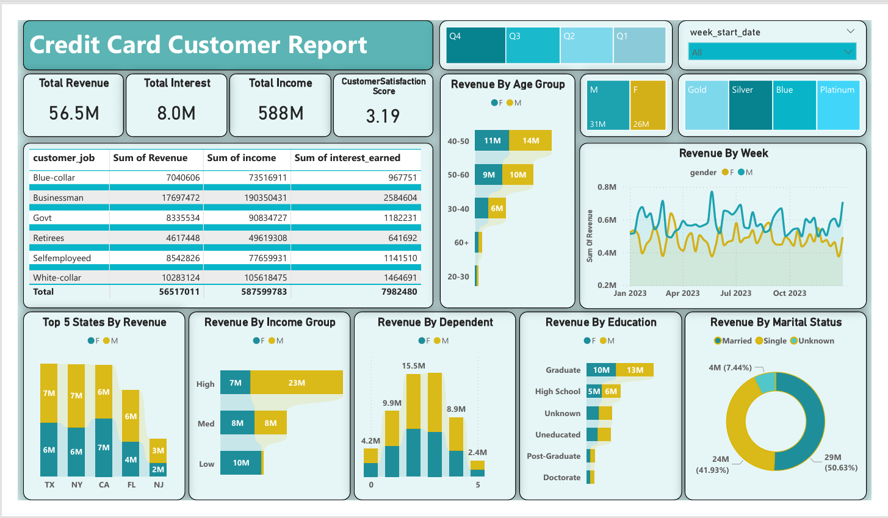
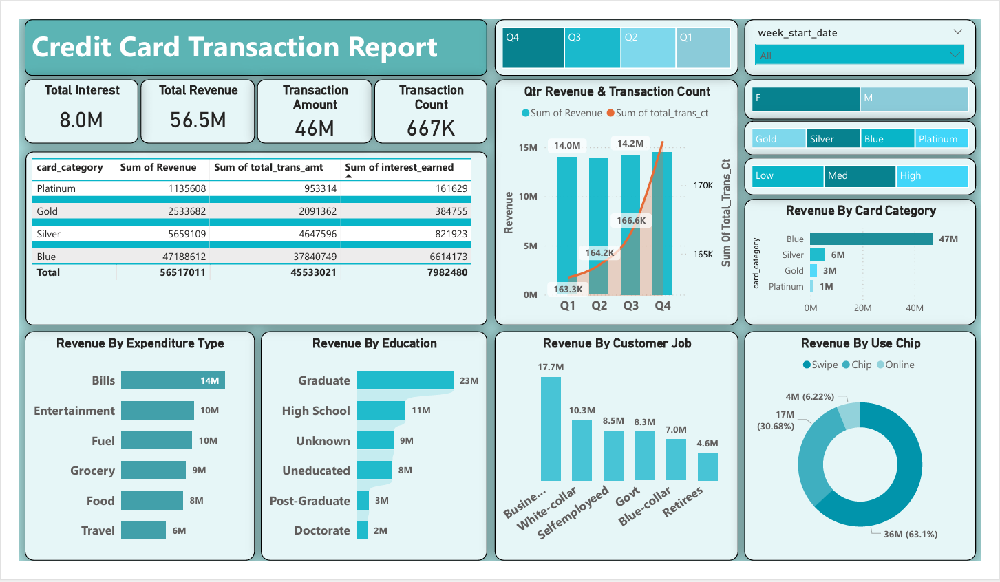

# Credit Card Analytics — Power BI Project

An end‑to‑end **Credit Card Analytics** project built with **Power BI** to analyze **customer behavior**, **card performance**, **revenue trends**, and **transaction insights** through interactive dashboards.

---

## 📊 Dashboard Preview

**Customer Report**


**Transaction Report**


**dashboard demo**


---

## 🎯 Project Objectives

- Understand **customer behavior** and segmentation patterns  
- Track **transaction trends** and spending distribution  
- Evaluate **card performance** across key KPIs  
- Monitor **revenue trends** and business growth insights  

---

## 🧰 Tools Used

- **Power BI Desktop**
- CSV datasets (included in the repo)

---

## 📁 Data Files (Included)

- `credit_card.csv` — transaction / card activity data  
- `customer.csv` — customer-level data  
- `cc_add.csv`, `cust_add.csv` — supporting / additional attributes  

---

## ✅ Step-by-Step: How to Run

### Step 1 — Download project files
Clone the repository or download as ZIP.

### Step 2 — Open the Power BI dashboard
Open:
- `Credit Card Dashboard.pbix` in **Power BI Desktop**

### Step 3 — Connect / refresh data
If Power BI prompts for file paths:
1. Place the CSV files in the same folder (recommended), or
2. Update the data source paths inside Power BI:
   - **Transform Data → Data source settings → Change Source**

Then click:
- **Refresh** to load the latest data.

### Step 4 — Explore the reports
Use slicers/filters to analyze:
- **Customer KPIs** and segmentation
- **Transaction patterns** over time
- **Revenue insights** and card performance trends

### Step 5 — Review business scope / requirements
Open:
- `Business Requirements.pdf`

### Step 6 — (Optional) SQL validation / analysis
Use:
- `SQL Queries.sql` to reproduce key calculations or validate metrics externally.

---

## 📌 Notes

- This project is designed for **Power BI Desktop** usage.
- All required datasets are included for easy reproducibility.

---

## 🗂️ Repository Structure

```
.
├── README.md
├── Credit Card Dashboard.pbix
├── Business Requirements.pdf
├── SQL Queries.sql
├── credit_card.csv
├── customer.csv
├── cc_add.csv
├── cust_add.csv
├── cc_customer_report.png
├── cc_transaction_report.png
└── dashboard_demo.gif
```
